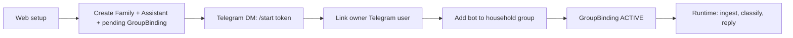
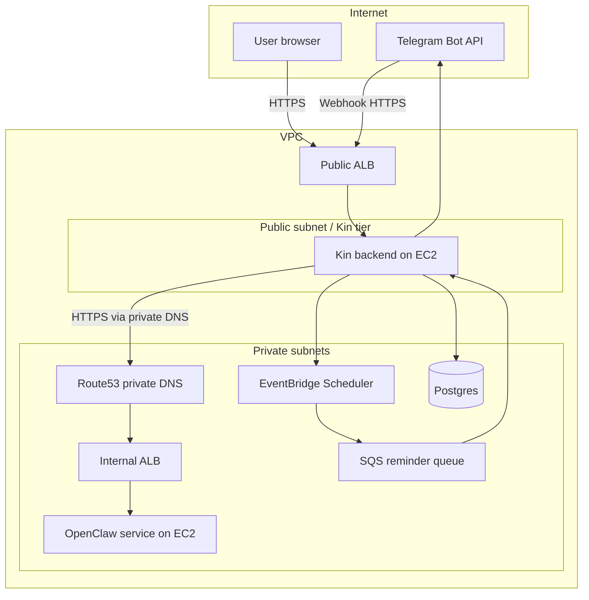
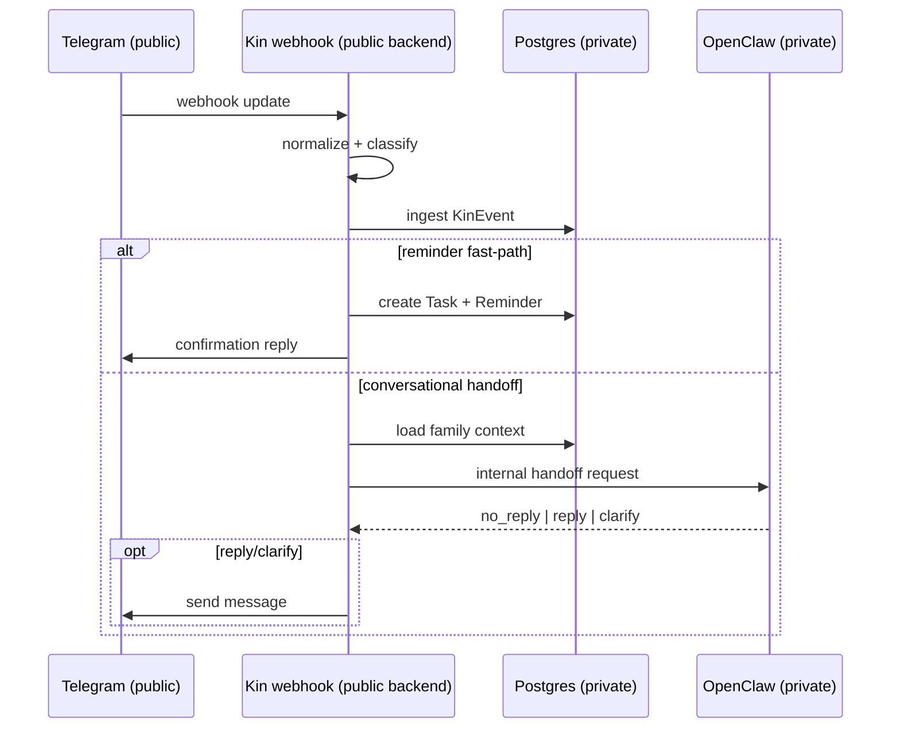

# Kin

Kin is a Telegram-first family coordination assistant.

It combines:
- a web onboarding shell (account + household setup),
- a Telegram group runtime (event ingestion and assistant replies),
- and a reminder pipeline (intent parsing, scheduling, and delivery).

The current repo is an MVP with a working end-to-end happy path and clear boundaries for what is already reliable vs what still needs hardening.

## 1) Product concept and user flow

Kin is designed around a **shared household group**, not isolated one-on-one sessions.

Typical flow:
1. Owner completes setup on the web.
2. Kin creates `User`, `Family`, `Assistant`, `OnboardingState`, and a pending `GroupBinding`.
3. Owner opens a Telegram DM deep link (`/start <token>`).
4. Owner adds the bot to the household group.
5. Kin activates the binding and marks onboarding complete.
6. New group messages are classified, stored as `KinEvent`, and optionally answered.



## 2) AWS deployment topology (interview-friendly)

Kin is intentionally split into:
- a **public Kin backend** that handles all internet-facing traffic,
- and a **private OpenClaw runtime** that handles internal reasoning.

This lets Telegram traffic enter safely while keeping the reasoning system off the public internet.

### Why each AWS component exists

- **Public ALB + Kin service (EC2-hosted app)**
  - Terminates public HTTPS and receives Telegram webhook traffic.
  - Hosts Kin API routes and onboarding web surfaces.

- **VPC with private subnets**
  - Keeps internal services unreachable from the internet by default.
  - Separates public entrypoints from internal reasoning and queue consumers.

- **Internal ALB for OpenClaw**
  - Exposes OpenClaw only inside the VPC.
  - Kin calls OpenClaw over private networking, never through public endpoints.

- **Route53 private DNS (internal domain)**
  - Gives Kin a stable internal hostname (for example `openclaw.internal`).
  - Decouples service discovery from EC2 instance IP changes.

- **ACM certificates**
  - Used for TLS on both public and internal load balancers.
  - Keeps Kin -> OpenClaw calls encrypted in transit.

- **EventBridge Scheduler + SQS reminder queue**
  - Scheduler triggers reminder delivery at the right time.
  - SQS absorbs retries/spikes and decouples scheduling from send execution.

### Trust boundaries

- **Public boundary:** Telegram and browser traffic reach only Kin’s public API surface.
- **Private boundary:** OpenClaw stays internal, reachable only from trusted Kin-side components.
- **Design intent:** user-visible messaging remains fast and simple, while reasoning and orchestration stay isolated.



## 3) Runtime flow: Telegram entry vs private reasoning

`POST /api/telegram/webhook` is the main runtime entrypoint.

High-level behavior:
1. Validate webhook secret.
2. Normalize raw Telegram update.
3. Classify route (`ignore`, `ingest_only`, `onboarding_event`, `handoff_fast`).
4. Ingest non-ignored event to `KinEvent` with dedupe + family/group scoping.
5. For `handoff_fast`:
   - try reminder fast-path first,
   - otherwise build conversation context,
   - call OpenClaw over private/internal network,
   - send reply for `reply` or `clarify`.



## 4) Reminder delivery architecture

Kin supports explicit reminder intent from Telegram messages.

- Reminder intent is parsed from `KinEvent` text (with continuation support).
- On success, Kin creates:
  - `Task(kind=REMINDER)`
  - `Reminder(status=SCHEDULED)`
- Kin schedules delivery through EventBridge Scheduler targeting SQS.
- Queue processing route: `POST /api/reminders/process-queue`
- Legacy/manual fallback route: `POST /api/reminders/fire`

```mermaid
flowchart LR
  M[Telegram message] --> W[Kin webhook]
  W --> R[Reminder intent parser]
  R -->|intent found| D[(Task + Reminder rows)]
  D --> S[EventBridge Scheduler]
  S --> Q[SQS reminder queue]
  Q --> C[/api/reminders/process-queue]
  C --> X[Deliver Telegram reminder]
```

## 5) Data model (MVP)

Core entities:
- `Family` (household)
- `User` (owner in v1)
- `Assistant` (runtime association)
- `OnboardingState`
- `GroupBinding` (Telegram binding lifecycle)
- `KinEvent` (normalized event log)
- `Task` + `Reminder`

Key statuses in active use:
- `GroupBinding`: `DM_STARTED -> BOT_ADDED -> ACTIVE`
- `OnboardingState`: pending/in-progress to `COMPLETE`
- OpenClaw response contract: `no_reply | reply | clarify`

## 6) Current status: production-ready vs MVP

### Working and reliable in current scope
- End-to-end Telegram-first onboarding happy path.
- Group activation and duplicate-group protection.
- Telegram event normalization/classification/ingestion with dedupe.
- Family/group context loading for runtime decisions.
- Fast OpenClaw handoff contract integration.
- Reminder creation path with Scheduler + SQS processing hooks.

### Still MVP / needs hardening
- OpenClaw transport currently uses `openclaw` CLI as client wrapper.
- Webhook path still combines onboarding, ingest, and handoff concerns.
- Operational resilience needs deeper retries/backoff/runbook coverage.
- Auth/session protections should be tightened before broad exposure.
- Observability is present but still light for production incident handling.

## 7) Local development

### Stack
- Next.js 16 (App Router)
- TypeScript
- Prisma + PostgreSQL
- Telegram Bot API
- Optional OpenClaw gateway transport
- Optional AWS Scheduler/SQS for reminders

### Quick start
```bash
npm install
npm run dev
```

If schema/client updates are needed:
```bash
npx prisma generate
npx prisma migrate dev
```

### Environment summary
Minimal required for core runtime:
- `DATABASE_URL`
- `TELEGRAM_BOT_TOKEN`
- `KIN_TELEGRAM_WEBHOOK_SECRET` (recommended/expected for trusted callbacks)
- `OPENCLAW_TRANSPORT_MODE` (`local-cli`, `remote-gateway`, `disabled`)

For remote OpenClaw gateway mode:
- `OPENCLAW_GATEWAY_URL`
- `OPENCLAW_GATEWAY_TOKEN`
- `OPENCLAW_BIN` (optional override, default `openclaw`)

For reminder scheduling/queue flow:
- `KIN_REMINDER_SCHEDULER_ROLE_ARN`
- `KIN_REMINDER_QUEUE_URL`
- `KIN_REMINDER_SCHEDULER_GROUP_NAME` (optional)
- `KIN_REMINDER_FIRE_SECRET` (for authenticated admin reminder routes)

Also used by onboarding UX:
- `KIN_TELEGRAM_BOT_USERNAME`

See `.env.example` for a full reference set.

## 8) API surfaces (current)

Onboarding and setup:
- `POST /api/setup`
- `POST /api/telegram/bindings/bootstrap`
- `POST /api/telegram/bindings/complete`
- `POST /api/telegram/bindings/status`

Runtime:
- `POST /api/telegram/webhook`

Reminders:
- `POST /api/reminders/process-queue`
- `POST /api/reminders/process-due`
- `POST /api/reminders/fire` (legacy/manual fallback)

## 9) Roadmap (practical next steps)

1. **Transport maturity**
   - move from CLI-wrapper dependency toward a direct gateway client path
   - tighten timeout/retry semantics and failure classification

2. **Runtime separation**
   - split webhook orchestration into cleaner modules/workers
   - keep onboarding and conversation processing independently evolvable

3. **Security and identity hardening**
   - strengthen auth/session model for public web surfaces
   - formalize secret rotation and environment posture by stage

4. **Reliability and observability**
   - structured metrics/tracing for ingest, routing, handoff, and reminders
   - explicit SLOs and alerting for reply latency and delivery success

5. **Test depth**
   - expand integration tests for onboarding edge cases
   - add deterministic tests for classifier/reminder intent behavior
   - add failure-injection tests for transport and queue processing

---

Kin is already a credible end-to-end MVP for Telegram household coordination.

The project’s current strength is a working product flow with sensible architectural direction, especially clear public/private boundaries for AWS deployment. The next phase is production hardening and operational depth.
