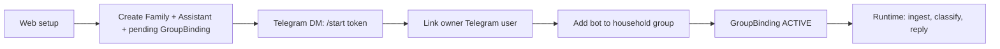
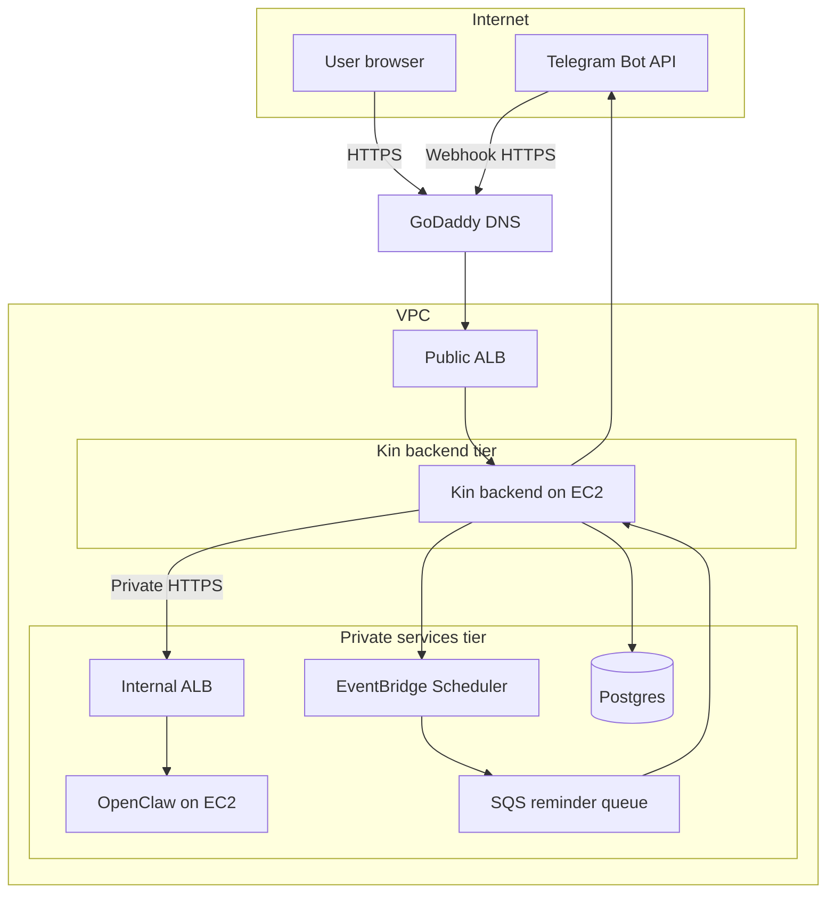
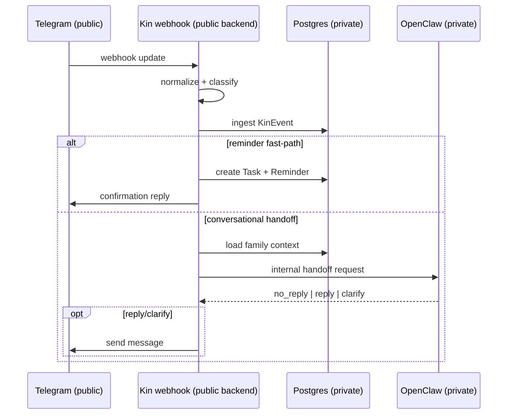
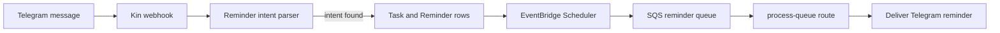

# Kin

Kin is a Telegram-first family assistant for shared household group chats.

The simplest way to describe it is this: Kin gives a family one shared assistant inside their Telegram group. The product handles onboarding on the web, group activity in Telegram, and reminders in the background.

This repo is still an MVP, but the full end-to-end flow works.

## 1) How I would explain the product

Kin is built around a **shared family group**, not separate one-on-one chats.

The user flow is simple:
1. The owner sets up the household on the web.
2. Kin creates the household and onboarding records.
3. The owner opens a Telegram DM deep link.
4. The owner adds the Kin bot to the family group.
5. Kin activates that group.
6. After that, messages in the group can be stored, understood, and answered.

That shared-group model is the main product choice. Instead of treating the assistant like a private chatbot, Kin treats it more like shared family infrastructure.



## 2) AWS architecture

The main architecture decision is that Kin is split into two services:
- a **public Kin backend**,
- and a **private OpenClaw service**.

Kin is the internet-facing layer, and OpenClaw is the private reasoning layer. Kin needs to be public because it serves the web app and receives Telegram webhooks. OpenClaw stays private because it handles internal reasoning and session logic.

### Main pieces

- **GoDaddy DNS**
  - sends public traffic to Kin

- **Public ALB -> Kin backend EC2**
  - handles public HTTPS
  - receives Telegram webhooks
  - serves Kin's web and API routes

- **Internal ALB -> OpenClaw EC2**
  - gives Kin a private path to OpenClaw
  - keeps OpenClaw off the public internet

- **VPC networking**
  - separates public traffic from private internal traffic

- **ACM certificates**
  - provide HTTPS on the load balancers

- **Postgres**
  - stores users, families, group bindings, events, tasks, and reminders

- **EventBridge Scheduler + SQS**
  - Scheduler decides when a reminder should run
  - SQS holds reminder jobs until Kin processes them

This setup makes the trust boundary very clear. Telegram and browser traffic only reach Kin. OpenClaw is not exposed directly.

### Trust boundaries

- **Public:** browser traffic and Telegram go to Kin
- **Private:** only Kin talks to OpenClaw
- **Reason:** user-facing traffic stays simple, but reasoning stays protected



## 3) Message flow

`POST /api/telegram/webhook` is the main runtime entrypoint.

Runtime flow:
1. Kin receives a Telegram webhook.
2. Kin decides what kind of event it is.
3. Kin stores the event in Postgres.
4. If it looks like a reminder request, Kin tries the reminder path first.
5. Otherwise, Kin loads recent context and calls OpenClaw through the internal path.
6. Kin sends a reply back to Telegram if needed.



## 4) Reminder flow

Kin also supports reminders from Telegram messages.

The reminder path works like this:
- Kin parses reminder intent from message text.
- If parsing succeeds, Kin creates:
  - a `Task`
  - a `Reminder`
- Kin schedules the reminder with EventBridge Scheduler.
- Scheduler pushes the job into SQS.
- Kin later processes the queue and sends the reminder back to Telegram.

This keeps scheduling and delivery decoupled instead of tying both steps to one synchronous request.

Main routes:
- `POST /api/reminders/process-queue`
- `POST /api/reminders/fire` (manual fallback)



## 5) Core data model

Main records:
- `Family`
- `User`
- `Assistant`
- `OnboardingState`
- `GroupBinding`
- `KinEvent`
- `Task`
- `Reminder`

Important status flows:
- `GroupBinding`: `DM_STARTED -> BOT_ADDED -> ACTIVE`
- OpenClaw response: `no_reply | reply | clarify`

## 6) Current status

### Working now
- Telegram-first onboarding happy path
- group activation and duplicate-group protection
- Telegram event ingest and dedupe
- context loading for replies
- OpenClaw handoff
- reminder creation and delivery flow

### Still MVP
- some internal paths are still tightly coupled
- OpenClaw transport still uses the `openclaw` CLI wrapper
- observability and retries need more work
- auth and session hardening still need improvement

So the honest summary is: the system works end to end, but there is still production hardening left to do.

## 7) Local development and Docker

### Stack
- Next.js 16
- TypeScript
- Prisma + PostgreSQL
- Telegram Bot API
- OpenClaw
- AWS Scheduler + SQS for reminders

### Local dev
```bash
npm install
npm run dev
```

If Prisma changes are needed:
```bash
npx prisma generate
npx prisma migrate dev
```

### Docker
Kin is also packaged with Docker for deployment.

- the repo includes a `Dockerfile`
- production deploys use `docker compose`
- this keeps the runtime consistent between local and EC2
- on EC2, Docker is the main way Kin is built and restarted

Typical deploy flow:
```bash
docker compose build --no-cache
docker compose up -d
```

Docker makes deployment more repeatable and keeps the runtime more predictable on EC2.

### Main environment variables
Core runtime:
- `DATABASE_URL`
- `TELEGRAM_BOT_TOKEN`
- `KIN_TELEGRAM_WEBHOOK_SECRET`
- `OPENCLAW_TRANSPORT_MODE`

OpenClaw gateway mode:
- `OPENCLAW_GATEWAY_URL`
- `OPENCLAW_GATEWAY_TOKEN`
- `OPENCLAW_BIN`

Reminders:
- `KIN_REMINDER_SCHEDULER_ROLE_ARN`
- `KIN_REMINDER_QUEUE_URL`
- `KIN_REMINDER_SCHEDULER_GROUP_NAME`
- `KIN_REMINDER_FIRE_SECRET`
- `KIN_REMINDER_TIMEZONE`

Onboarding:
- `KIN_TELEGRAM_BOT_USERNAME`

## 8) Main API routes

Onboarding:
- `POST /api/telegram/bindings/bootstrap`
- `POST /api/telegram/bindings/status`

Runtime:
- `POST /api/telegram/webhook`

Reminders:
- `POST /api/reminders/process-queue`
- `POST /api/reminders/process-due`
- `POST /api/reminders/fire`

## 9) Roadmap

The next steps are mostly about hardening the system:
- replace the CLI wrapper with a more direct OpenClaw client path
- split large runtime flows into cleaner modules
- improve auth and session security
- add stronger metrics, logs, and alerts
- expand integration and failure-path testing

---

Kin is a working MVP with a clear system design:
- a public Kin backend,
- a private OpenClaw runtime,
- and AWS-based reminder scheduling.

The next step is making it more robust, easier to operate, and easier to scale.
